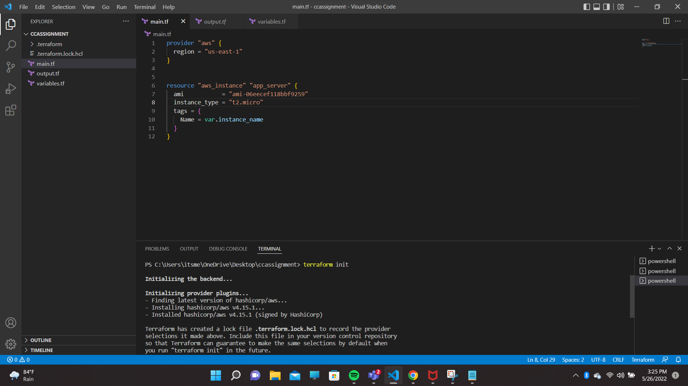
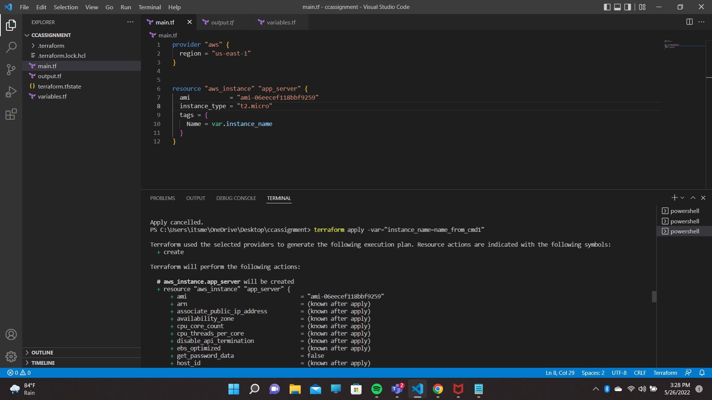
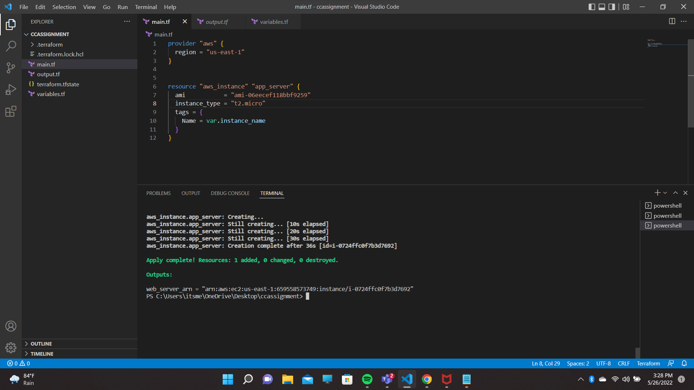
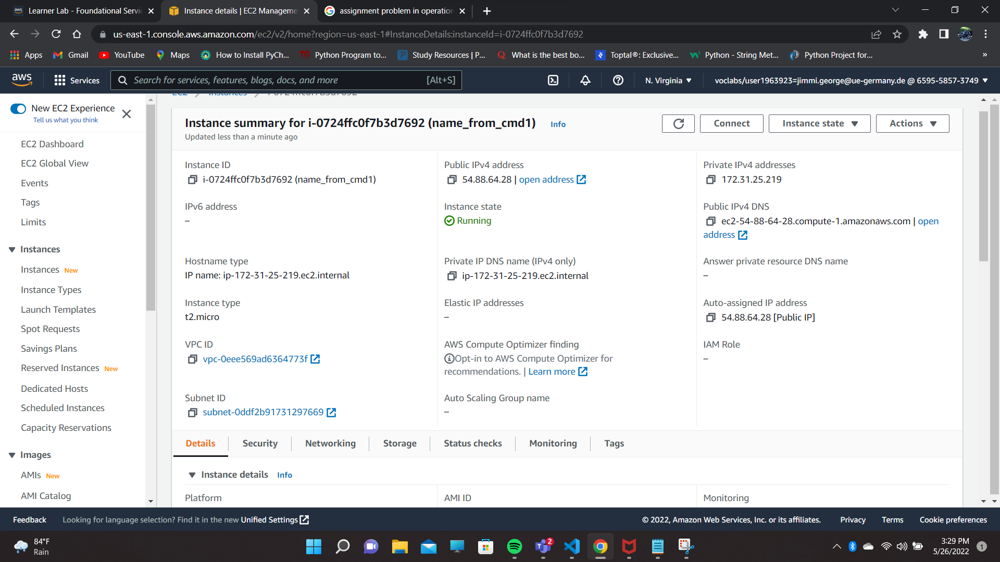
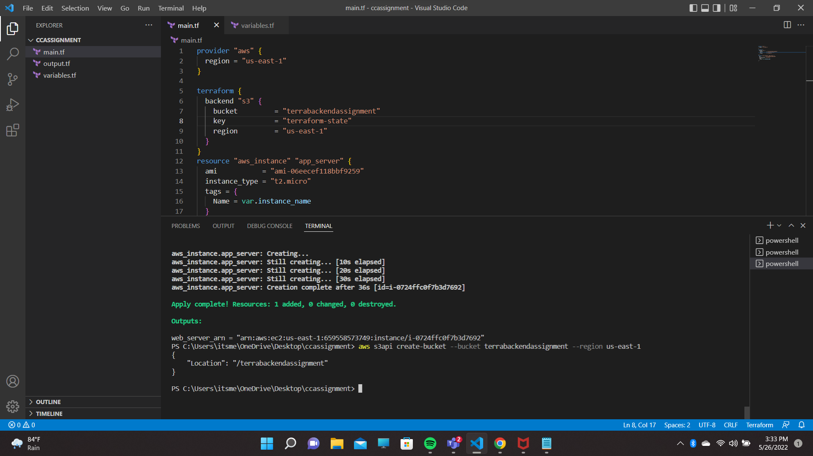
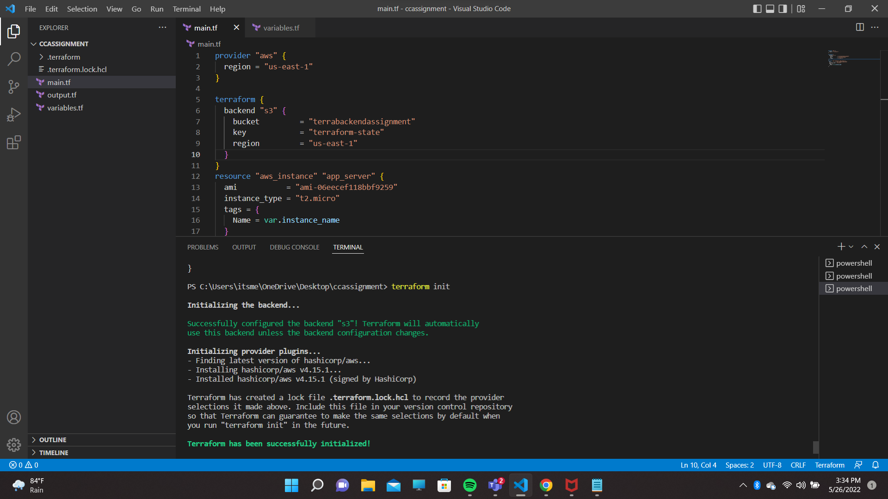
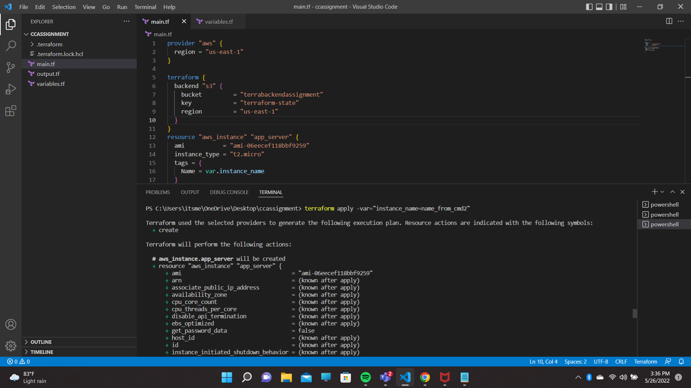
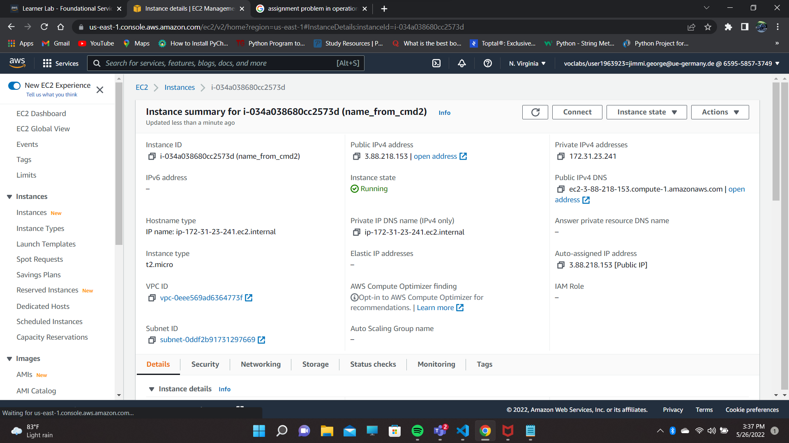
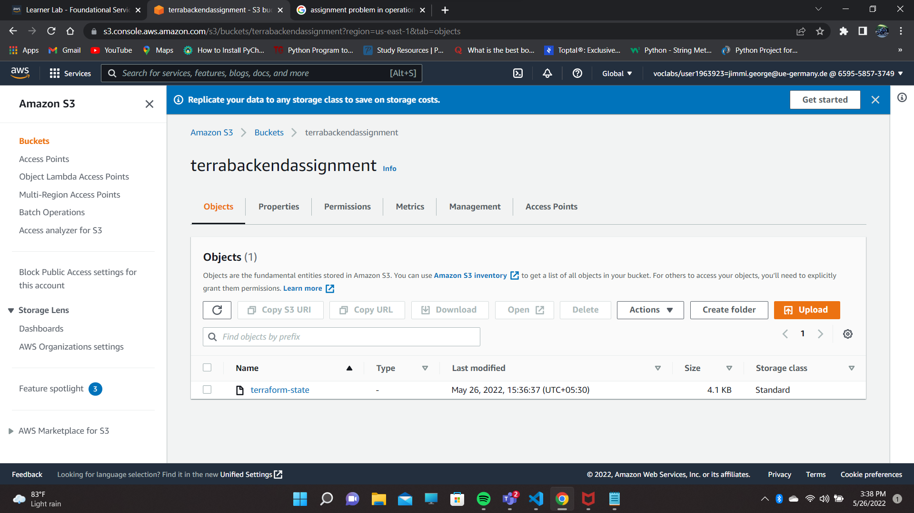
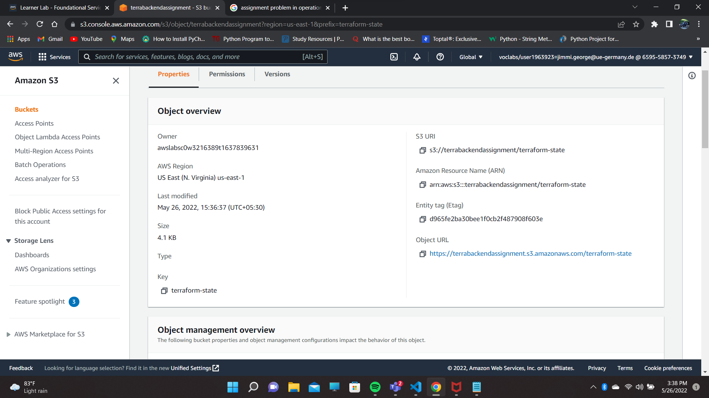

# cloud computing assignment EC2 creation through terraform;images included for reference
configure CLI and terraform  run the following code 
 
to store the terraform state in local system exclude the following code in main
 
terraform {
 
  backend "s3" {
   
    bucket         = "terrabackendassignment"
     
    key            = "terraform-state"
     
    region         = "us-east-1"
     
  }
   
run the following commands in terminal
 
1.terraform init (it will initialize terraform)
 

 
2.terraform plan(it will determine the desired state of all the resources it declares, then compares that desired state to the real infrastructure objects being managed with the current working directory and workspace.)
 
3.terraform apply -var="instance_name=name_from_cmd1" (for overriding instance name through command line)
 

 
ec2 instance named "name_from_cmd1" will be created
 

 

 
 
s3 as backend
 
create a bucket for storing terraform state by executing following command in terminal
 
1.aws s3api create-bucket --bucketbucket named "terrabackendassignment" will be createdt --region us-east-1
 
bucket named "terrabackendassignment" will be created
 

 
to store terraform state include the following codes in main when running(already included in the uploaded file)
 
terraform {
 
  backend "s3" {
   
    bucket         = "terrabackendassignment"
     
    key            = "terraform-state"
     
    region         = "us-east-1"
     
  }
   
run the following commands in terminal
 
1.terraform init (it will initialize terraform)
 

 
2.terraform plan(it will determine the desired state of all the resources it declares, then compares that desired state to the real infrastructure objects being managed with the current working directory and workspace.)
 
3.terraform apply -var="instance_name=name_from_cmd2" (for overriding instance name through command line)
 

ec2 instance named "name_from_cmd2" will be created and a bucket named"terrabackendassignment" will have the terraform state.
 

 

 

